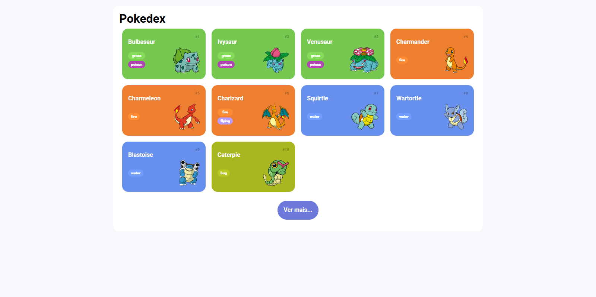
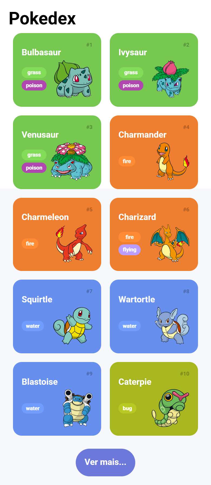

# Projeto JavaScript - Pokédex Interativa 🎮

## 📌 Sobre o Projeto

Este projeto foi desenvolvido como parte da formação em JavaScript da [Dio.me](https://www.dio.me/), com o objetivo de praticar requisições assíncronas com `fetch`, manipulação do DOM e interações dinâmicas com JavaScript puro.

A aplicação consiste em uma Pokédex moderna, que consome dados da [PokeAPI](https://pokeapi.co/) para exibir uma lista de Pokémon com seus tipos, imagens e detalhes. Ao clicar em um Pokémon, um modal é aberto com suas estatísticas completas, tipos, animação interativa e opção de favoritá-lo utilizando `localStorage`.

## 💻 Tecnologias Utilizadas

- **HTML5**  
- **CSS3** (com foco em Grid e responsividade)  
- **JavaScript (ES6+)**
- **PokeAPI REST**
- **LocalStorage**
- **Normalize.css**

## ⚙️ Funcionalidades

- Listagem de Pokémon com carregamento incremental (`"Ver mais..."`)
- Exibição de tipos e imagens animadas
- Modal com informações detalhadas e atributos (HP, Ataque, Defesa etc.)
- Animação de pulo ao clicar na imagem
- Favoritar Pokémon (persistência com `localStorage`)
- Responsividade para dispositivos móveis
- Acessibilidade com suporte à tecla `ESC` e clique fora do modal para fechar

## 📸 Prévia

### Versão Desktop
  
> *Imagem ilustrativa da versão desktop da Pokédex.*

### Versão Mobile  
  
<em>Imagem ilustrativa da versão mobile da Pokédex.</em>

## 🔗 Acesse o Projeto

🌐 [Clique aqui para visualizar online](https://luis-fellipe.github.io/javascript-pokedex/)

---

## 🧠 Autor

Este projeto foi desenvolvido por [Luís Fellipe](https://www.linkedin.com/in/luis-fellipe-real) como parte da formação em JavaScript.
